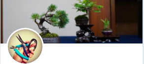

# ツイ盆展とは

"だれでも気軽に出展できる"、そんな展示会を目指して作られたオンライン盆栽展が「ツイ盆展」です。

盆栽を飾ったことのある方から飾ったことのない方まで、盆栽を始めたばかりの初心者から樹齢何十年という木を育てているベテランさんまで、立派な棚飾りを持っている人からおなべのフタしか持っていない人まで、誰でも出展して誰でも楽しめる盆栽展です。

ツイ盆展に出展したら、また気になる盆栽が出展されていたら、是非Twitterで出展者さんと交流してみましょう。
是非、この機会にtwitterでこの盆栽コミュニティを一緒に育てませんか。

# 運営者

ツイ盆展は以下３名の有志によって運営されています。

---

**百万@盆栽エッセイ漫画連載中** [@hyakumanga](https://twitter.com/hyakumanga)

プロフィールはこちら

---

**ichiya/falz** [@falz_jp](https://twitter.com/falz_jp)

プロフィールはこちら

---

**fujimax -盆栽HACKS-** [@fujimax6](https://twitter.com/fujimax6)

ちいさな自宅の庭で３００鉢の小品盆栽/ミニ盆栽を育てる盆栽趣味家3年目。
 近所の盆栽会に所属して1年が経つ頃ようやく自分でも席飾りを出展し、盆栽を育てる楽しさだけでなく、飾る楽しさ見せる楽しさに気付く。
Twitter上で盆栽を趣味とする人たちとつながり、一人の中に閉じこもりがちなこの趣味を他の人と共有できることの楽しさを覚えた。 この輪をもっと広げていくにはどうすればいいかを日々考えている。
